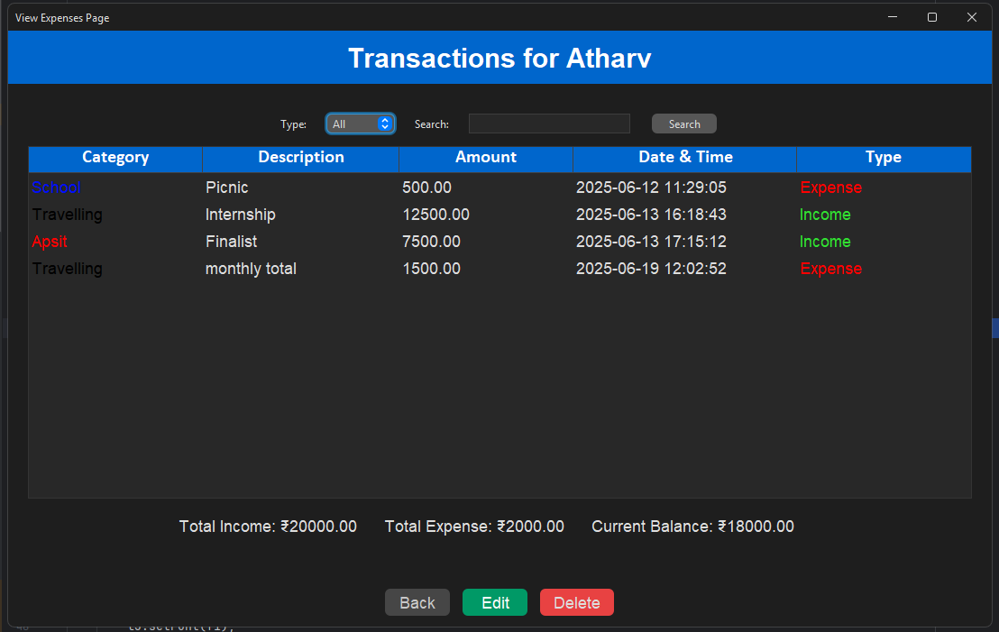
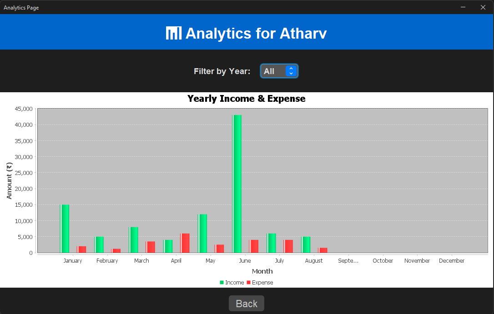

# 💸 Smart Expense Tracker

[](https://www.java.com/)
[](https://www.mysql.com/)
[](https://docs.oracle.com/javase/tutorial/uiswing/)
[](LICENSE)

Smart Expense Tracker is a desktop application built with Java Swing and MySQL that lets you record, categorize, and analyze income and expenses. Features include category management with colors, transaction filtering & search, year-wise analytics with bar charts (JFreeChart), and a customizable FlatLaf theme for a modern UI.

---

## 📷 Preview

  
_User login screen._  

  
_New user registration form._  

  
_Main dashboard with theme customization using FlatLaf.
Easily switch between themes via the dropdown, alongside quick navigation to core features._  

  
_Form to add a new income or expense entry._  

  
_Page showing a list of all income/expense transactions with filter, search, update and delete transactions features._  

  
_Analytics view with month-wise income and expense bar chart. Also you can filter by year._  

  
_Form to create a new category with a name and color._  

  
_View, edit, or delete existing categories._  


---

## 🧠 Features

- ✅ User Registration & Secure Login
- ✅ Add/Edit/Delete Transactions
- ✅ Manage Custom Categories (Name + Color)
- ✅ Income/Expense Summary Panel
- ✅ Real-time Minimum Balance Warning
- ✅ Monthly Analytics with Bar Charts (via JFreeChart)
- ✅ Filter & Search Transactions by Type/Keyword
- ✅ Clean, intuitive Swing UI with modern layout

---

## 🗃️ Tech Stack

| Layer        | Technology             |
|-------------|------------------------|
| 💻 Language  | Java (JDK 17+)         |
| 🖥️ UI       | Java Swing (AWT/Swing) |
| 🗄️ Database | MySQL 8.x              |
| 📊 Charts   | JFreeChart              |

---

## ⚙️ Database Schema

### 🔐 `users` Table
```sql
CREATE TABLE users (
  id INT AUTO_INCREMENT PRIMARY KEY,
  username VARCHAR(50) NOT NULL UNIQUE,
  email VARCHAR(100),
  password VARCHAR(100) NOT NULL
);
```
### 🗂️  `categories` Table
```sql
CREATE TABLE categories (
  id INT AUTO_INCREMENT PRIMARY KEY,
  user_id INT NOT NULL,
  name VARCHAR(50) NOT NULL,
  color VARCHAR(7) NOT NULL,
  FOREIGN KEY (user_id) REFERENCES users(id)
);
```
### 💳 `transactions` Table
```sql
CREATE TABLE transactions (
  id INT AUTO_INCREMENT PRIMARY KEY,
  username VARCHAR(50) NOT NULL,
  category_name VARCHAR(50) NOT NULL,
  description VARCHAR(255),
  amount DECIMAL(10,2) NOT NULL,
  date TIMESTAMP DEFAULT CURRENT_TIMESTAMP,
  type ENUM('income','expense') NOT NULL DEFAULT 'expense'
);
```

## 🚀 Getting Started

### 1. Clone the Repo
```bash
git clone https://github.com/thisisAtharv/ExpenseTracker.git
cd ExpenseTracker
```
### 2. Configure MySQL
- Create a database: expense_tracker
- Run the provided SQL script (schema.sql) or create tables manually (see above)
### 3. Update DB Credentials
Open your relevant .java files and update the database connection info:
```java
String url = "jdbc:mysql://localhost:3306/expense_tracker";
String user = "root";
String password = "your_password";
```
### 4. Build & Run
- Compile the project using your IDE (e.g., IntelliJ, Eclipse) or the terminal
- Run the Main.java or Login.java class to launch the application

## 📂 Project Structure
```bash
src/
├── db/
│   └── DBConnection.java
├── model/
│   ├── AddExpense.java
│   ├── Analytics.java
│   ├── Category.java
│   ├── CreateCategory.java
│   ├── Home.java
│   ├── LoginPage.java
│   ├── RegisterPage.java
│   ├── ViewCategory.java
│   └── ViewExpense.java
```

## 📝 License
This project is licensed under the MIT License - see the LICENSE file for details.

## 🙌 Acknowledgements
- [Java Swing Documentation – Oracle](https://docs.oracle.com/javase/8/docs/api/javax/swing/package-summary.html)
- [JFreeChart – Official Site](http://www.jfree.org/jfreechart/)
